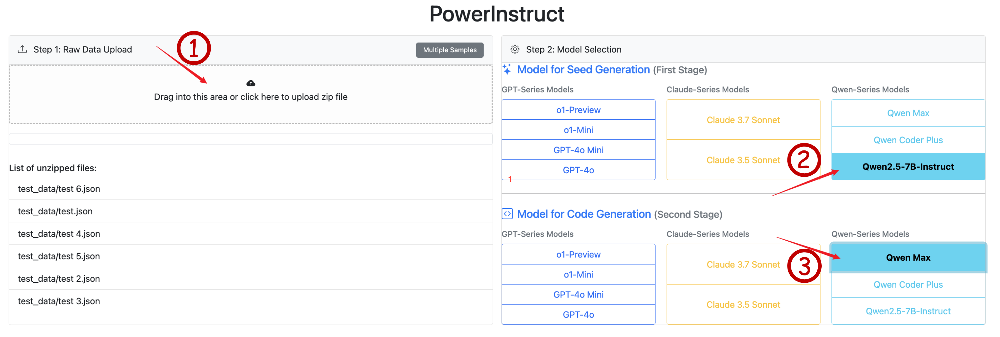

# PowerInstruct: Power System Instruction Dataset Generation Tool  

## Project Overview  

PowerInstruct is an automated dataset generation tool for power system instructions based on large language models. The tool supports two generation modes:  

1. **Seed Generation**: Uses models like GPT-4o/Qwen to generate seed data in a standard format.  
2. **Code Generation**: Uses models like Claude/o1 to generate transformation code based on the seed data, enabling batch dataset generation.  

### Key Features  
- Supports multiple large language models (GPT-4o, Claude, Qwen, etc.)  
- Batch data processing capabilities  
- Real-time execution result display  
- Supports JSON/JSONL format export  
- Visualization platform support  

## Installation Guide  

1. Clone the repository  
```bash
git clone https://github.com/Joserii/PowerInstruct.git
cd PowerInstruct
```  

2. Create and activate a virtual environment  
```bash
conda create -n powerinstruct python=3.10
conda activate powerinstruct
```  

3. Install dependencies  
```bash
pip install -r requirements.txt
```  

4. Configure environment variables (OpenAI, Anthropic, Qwen API key support)  
You need to manually set the following environment variables in your terminal:  

- Linux/macOS (bash/zsh):  
```bash
export OPENAI_API_KEY="sk-xxxxxxx"
export OPENAI_BASE_URL="https://api.openai.com/v1"

export ANTHROPIC_API_KEY="sk-xxxxxxx"
export ANTHROPIC_BASE_URL="https://api.anthropic.com/v1"

export DASHSCOPE_API_KEY="sk-xxxxxxxxx"
export DASHSCOPE_BASE_URL="https://dashscope.aliyuncs.com/compatible-mode/v1"
```  

- Windows (Powershell):  
```bash
$env:OPENAI_API_KEY="sk-xxxxxx"
$env:OPENAI_BASE_URL="https://api.openai.com/v1"

$env:ANTHROPIC_API_KEY="sk-xxxxxx"
$env:ANTHROPIC_BASE_URL="https://api.anthropic.com/v1"

$env:DASHSCOPE_API_KEY="sk-xxxxxxx"
$env:DASHSCOPE_BASE_URL="https://dashscope.aliyuncs.com/compatible-mode/v1"
```  

## Quick Start  

1. Start the service  
```bash
python run.py
```  

2. Access the web interface  
- Open your browser and visit `http://localhost:5000`  

3. Workflow  
   - Upload a data file (JSON format supported)  
   - Select the model to use (different models can be chosen for Seed Generation and Code Generation)  
   - Execute seed data generation  
   - Merge code generation templates  
   - Execute code generation  
   - Download the generated dataset (JSON/JSONL format supported)  

  
  

## Project Structure  

```
powerinstruct/
├── app/                    # Backend service
│   ├── api/                # API routes
│   ├── core/               # Core business logic
│   ├── services/           # Service layer
│   └── utils/              # Utility functions
├── static/                 # Frontend assets
│   ├── css/                # Stylesheets
│   └── js/                 # JavaScript files
│   templates/              # HTML templates
├── data/                   # Data directory
│   ├── templates/          # Template files
│   └── uploads/            # Uploaded files
├── config/                 # Configuration files
├── tests/                  # Test cases
├── requirements.txt        # Project dependencies
└── README.md               # Project documentation
```  

## Core Features  

1. **File Handling**  
   - Supports JSON file uploads  
   - File format validation  
   - Batch file processing  

2. **Model Integration**  
   - Supports multiple large language models  
   - Configurable model parameters  
   - Error retry mechanism  

3. **Data Generation**  
   - Seed data generation  
   - Code template generation  
   - Batch data transformation  

4. **Result Export**  
   - JSON format export  
   - JSONL format export  
   - Instruction data extraction  

## Configuration Guide  

1. **Model Configuration**  
```python
SUPPORT_MODELS = [
    # Qwen Series
    "qwen-max",
    "qwen-coder-plus",
    "qwen2.5-7b-instruct",

    # OpenAI Series
    "o1",
    "o1-mini",
    "gpt-4o",
    "gpt-4o-mini",

    # Anthropic Claude Series
    "claude-3-7-sonnet",
    "claude-3-5-sonnet"
]
```  

2. **Template Configuration**  
```json
{
    "prompt": "your_prompt_template",
    "codegen": "your_code_template"
}
```  
