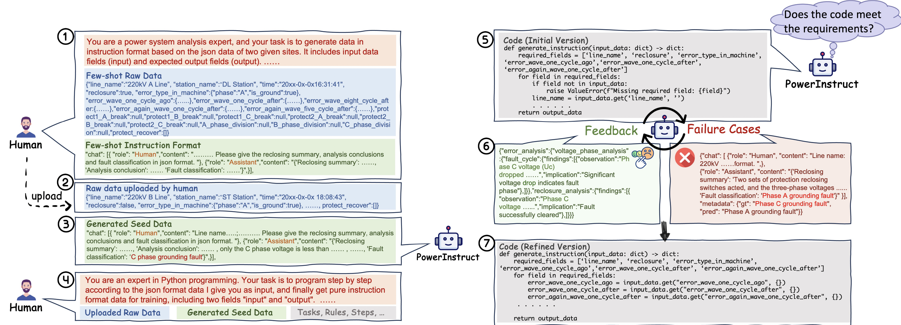
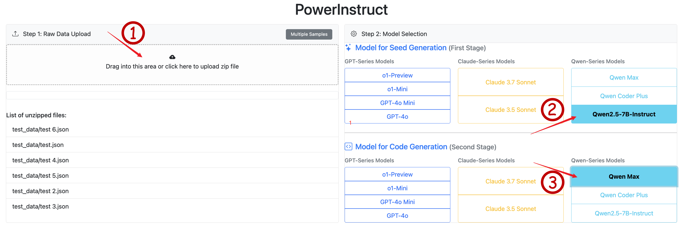
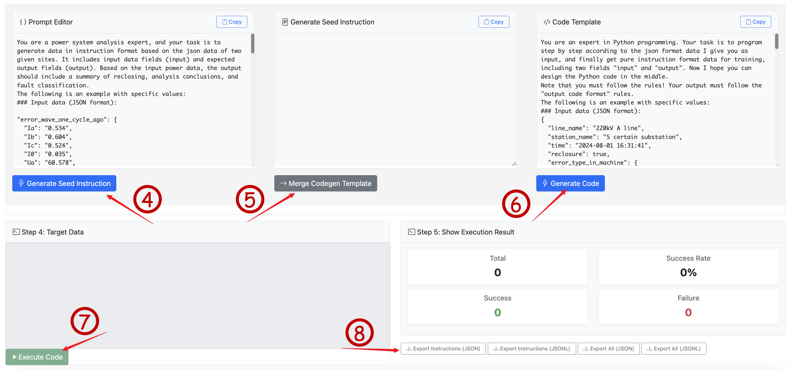

# PowerInstruct: 电力系统指令数据集生成工具

## 项目简介

PowerInstruct 是一个基于大模型的电力系统指令数据集自动化生成工具。该工具支持两种生成方式：

1. **Seed Generation**：先使用GPT4o/Qwen等大模型生成标准格式的种子数据。
2. **Code Generation**：使用Claude/o1等模型，基于种子数据生成转换代码，实现批量数据生成。


主要特点：
- 支持多种大模型（GPT-4o、Claude、Qwen等）
- 批量数据处理能力
- 实时执行结果展示
- 支持JSON/JSONL格式导出
- 可视化平台展示

## 安装指南

1. 克隆项目
```bash
git clone https://github.com/Joserii/PowerInstruct.git
cd PowerInstruct
```

2. 创建并激活虚拟环境
```bash
conda create -n powerinstruct python=3.10
conda activate powerinstruct
```

3. 安装依赖
```bash
pip install -r requirements.txt
```

4. 配置环境变量(OpenAI, Anthropic, Qwen API Key 支持)
这里需要手动在终端中设置如下环境变量：

- Linux/macOS (bash/zsh)：
```bash
export OPENAI_API_KEY="sk-xxxxxxx"
export OPENAI_BASE_URL="https://api.openai.com/v1"

export ANTHROPIC_API_KEY="sk-xxxxxxx"
export ANTHROPIC_BASE_URL="https://api.anthropic.com/v1"

export DASHSCOPE_API_KEY="sk-xxxxxxxxx"
export DASHSCOPE_BASE_URL="https://dashscope.aliyuncs.com/compatible-mode/v1"
```

- Windows：(Powershell)
```bash
$env:OPENAI_API_KEY="sk-xxxxxx"
$env:OPENAI_BASE_URL="https://api.openai.com/v1"

$env:ANTHROPIC_API_KEY="sk-xxxxxx"
$env:ANTHROPIC_BASE_URL="https://api.anthropic.com/v1"

$env:DASHSCOPE_API_KEY="sk-xxxxxxx"
$env:DASHSCOPE_BASE_URL="https://dashscope.aliyuncs.com/compatible-mode/v1"
```


## 快速开始

1. 启动服务
```bash
python run.py
```

2. 访问Web界面
- 打开浏览器访问 `http://localhost:5000`

3. 使用流程
   - 上传数据文件（支持JSON格式）
   - 选择使用的模型（Seed生成和Code生成可以选择不同模型）
   - 执行种子数据生成
   - 合并代码生成模板
   - 执行代码生成
   - 下载生成的数据集（支持JSON/JSONL格式）




## 项目结构

```
powerinstruct/
├── app/                    # 后端服务
│   ├── api/                # API路由
│   ├── core/               # 核心业务逻辑
│   ├── services/           # 服务层
│   └── utils/              # 工具函数
├── static/                 # 前端界面
│   ├── css/                # 样式文件
│   └── js/                 # JavaScript文件
│   templates/              # HTML模板
├── data/                   # 数据目录
│   ├── templates/          # 模板文件
│   └── uploads/            # 上传文件
├── config/                 # 配置文件
├── tests/                  # 测试用例
├── requirements.txt        # 项目依赖
└── README.md               # 项目文档
```

## 核心功能

1. **文件处理**
   - 支持JSON文件上传
   - 文件格式验证
   - 批量文件处理

2. **模型调用**
   - 支持多种大模型
   - 模型参数配置
   - 错误重试机制

3. **数据生成**
   - 种子数据生成
   - 代码模板生成
   - 批量数据转换

4. **结果导出**
   - JSON格式导出
   - JSONL格式导出
   - 指令数据提取

## 配置说明

1. 模型配置
```python
SUPPORT_MODELS = [
    # Qwen 系列
    "qwen-max",
    "qwen-coder-plus",
    "qwen2.5-7b-instruct",

    # OpenAI 系列
    "o1",
    "o1-mini",
    "gpt-4o",
    "gpt-4o-mini",

    # Anthropic Claude 系列
    "claude-3-7-sonnet",
    "claude-3-5-sonnet"
]
```

2. 模板配置
```json
{
    "prompt": "your_prompt_template",
    "codegen": "your_code_template"
}
```
